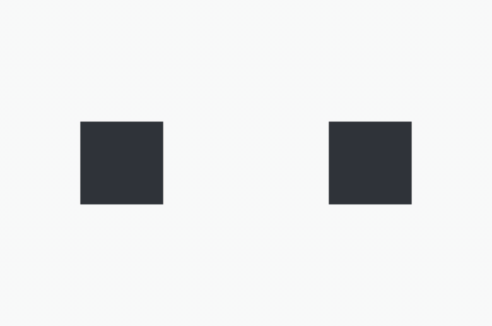

# Rectangles exercise
## Description
This repo contains the python script along with a [link to a downloadable executable file](https://drive.google.com/file/d/1AvFMvsM9kbSJ0WEoxaZSdLYx9Gq14-MX/view?usp=sharing) running a simple application for interacting with two rectanlges.
The rectangles can be moved around the screen with a mouse and resized with arrow keys. Currently selected rectangle is outlined with a light-green bounding box. The notification message is shown in case the rectangles overlap.

  

  
  

The application is written in Python 3.7 using [Pygame](https://www.pygame.org/docs/).

## Requirements
To run the script locally, first make sure you have Python 3.7+ [installed](https://www.python.org/downloads/).

Install dependencies:
`pip install pygame`

## Running the app
There are three options to run the app.

### Run the `exec` file
You can run the application directly by executing the `rectangles` exec file, which you can [download from Google Drive](https://drive.google.com/file/d/1AvFMvsM9kbSJ0WEoxaZSdLYx9Gq14-MX/view?usp=sharing) (stored externally due to file size limit on githib). Once downloaded, run the file locally. It might take up to 20 sec for the app to load.

_The exec file was created with [pyinstaller](https://www.pyinstaller.org/) utility and tested on MacOS Catalina 10.15.7._

### Run the script locally
Navigate to the folder with the `rectangles.py` script and run the command: `python rectangles.py`

### Run script online
Run the script in the [online IDE](https://repl.it/@Sea94/Resizable-and-movable-rectangles).

_Disclaimer: To the best on my knowledge, [Repl.it](https://repl.it/) is the only online platform supporting pygame rendering. However, its performance is [unstable](https://repl.it/talk/ask/Pygame-code-not-running/23938#73310), and it doesn't always render the app successfully. Re-running the code several times may possibly solve the issue._

## Known issues
* User can drag the rectangle outside the application window.
* Resizing the rectangle is done discretely on arrow key input. If the button is kept pressed, the rectangle doesn't keep resizing smoothly.
* The rectangles overlay the overlap notification message.

## Directions for improvement
* Fix the known issues.
* Make rectangles resizable with mouse events rather than keyboard input to use single interaction modality.
* Possibly, only highlight the intersection area when the rectangles overlapinstead of highlighting the whole rectangle shape.
